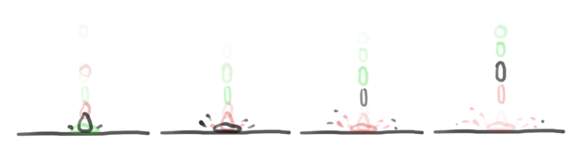

# Qu'est-ce qu'on peut faire à l'atelier ?

[Retour à l'accueil](index.md)

L'atelier  est libre et accessible à tous. On peut y fabriquer des choses, réparer des objets, apprendre à dessiner et rencontrer d'autres personnes qui  s'intéressent à la création.

Pour plus d'information sur son fonctionnement voir [les règles et l'organisation de l'atelier](organisation.md).


Voici quelques tutoriels de choses que l'on peut y faire, mais les possibilités de création ce ne limite pas à cette liste !

[TOC]

### Colorisation de dessins sur ordinateur

 *à jour*


Colorier  avec des crayons et des feutres ça prend du temps, et si on change d'avis il faut tout recommencer. En scannant notre dessin on peut  ensuite le coloriser dans des logiciels comme GIMP ou Krita, et ça prend  seulement quelques secondes.

Pour coloriser un dessin sur l'ordinateur il faut :

- avoir une idée et la dessiner (et oui)
- numériser son dessin
- régler le contraste sur l'ordinateur pour avoir des traits nets
- utiliser différents outils pour ajouter de la couleurs à son dessin

```
durée : 30 mintues à 1 heure
```

[vers le tuto](faire/colorisation.md)


### Dessin animé sur ordinateur

 *à jour*



Créer son propre gif animé ou faire des scène de dessin animé ? Comment on fait ?! Et bien c'est par ici !

Il faut :

- avoir une idée et faire un croquis
- dessiner les images principale de l'animation
- rajouter des images intermédiaires
- ajuster l'animation et ajouter des détails

```
durée : 30 minutes à 1 heure
```

[vers le tuto](faire/animation.md)


### Fabrication d'autocollants

 *en construction*


Avec  notre découpeuse, nos rouleaux de vinyle adhésif et l'aide du logiciel Inkscape on peut faire des autocollants. On peut faire ce que l'on veut  du moment qu'on sait le dessiner à la main ou sur l'ordinateur et on a  le choix parmi toutes nos couleurs de vinyles !

Pour faire un autocollant il faut :

- avoir une idée et la dessiner
- numériser son dessin
- transformer le dessin en tracé (format .svg)
- s'assurer que les réglages de la machine sont bons
- envoyer notre tracé à la machine pour la découpe
- prendre son autocollant découpé et le préparer

```
durée : 30 minutes à 1 heure
```

[vers le tuto](faire/autocollant.md)


### Découpage de papier à la machine

 *en construction*


La  découpeuse permet aussi de découper du papier. Avec des petites techniques ingénieuses on peut s'amuser à donner du volume à nos créations.

Il découper une forme dans du papier il faut :

- avoir une idée et la dessiner sur l'ordinateur
- bien préparer son tracé (format .svg) avec une technique spéciale
- s'assurer que les réglages de la machine sont bons
- envoyer notre tracé à la machine pour la découpe
- plier notre dessin pour lui donner du volume

```
durée : 30 minutes à 1 heures
```

[vers le tuto](faire/decoupe-papier.md)


### Modélisation 3D

 *en construction*


Pour  utiliser l'imprimante 3D il faut d'abord modéliser un objet pour que la  machine sache quoi imprimer. En utilisant un logiciel simple et  disponible en ligne comme Tinkercad on va apprendre à faire de la 3D !

Pour faire un modèle en 3D il faut :

- avoir une idée
- la décomposer en forme simple
- la construire avec les formes disponibles dans le logiciel de 3D

```
durée : 30 minutes à  1 heure
```

[vers le tuto](faire/modelisation.md)
