# Dessin animé sur ordinateur

[retour à la liste des tutos](faire.md)

 *à jour*

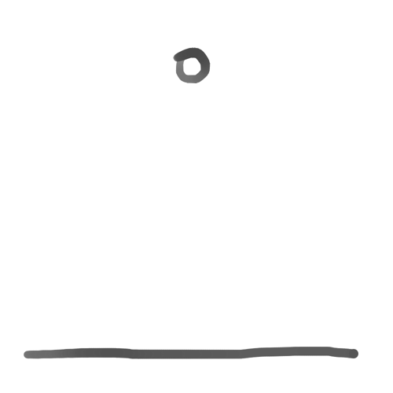

Le dessin animé c'est juste des images qui défilent vite !

```
durée : 30 minutes à 1 heure
```


**Les étapes :**

[TOC]

Ici nous allons animer une balle qui rebondit en boucle. **Mais n'hésitez pas à animer votre propre idée, la méthode est la même.** Cette page vous guidera pour comprendre les bases de l'animation dans Krita.


## Avoir une idée et faire un croquis

Partir d'une idée simple à animer et faire un croquis des différentes étapes.

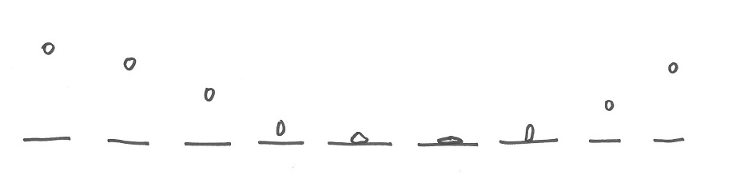


## Ouvrir Krita

Si ce n'est pas déjà fait, passer l'espace de travail de Krita en mode `Animation` (en haut à droite).

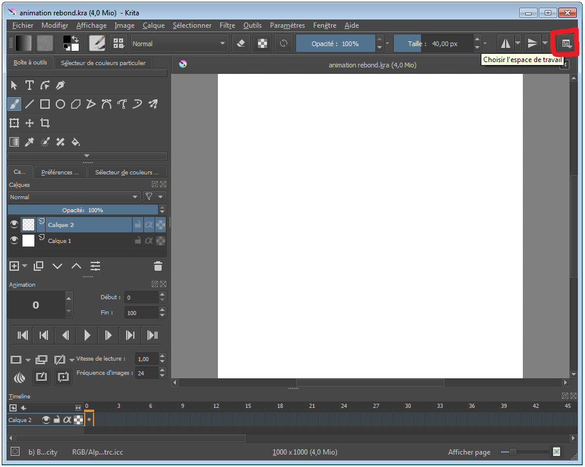


**Bien définir ce qui ne bouge pas et ce qui doit être animé.**

Dans  notre cas le sol va rester le même pendant toute l'animation, c'est la  balle qui va changer. On va donc les dessiner sur des claques  différents.

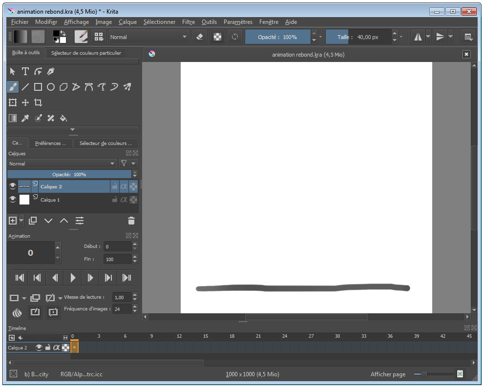


On va desormais **ajouter un autre calque** en cliquant sur le bouton `+`. C'est sur celui ci que nous allons animer notre balle. Bien s'assurer que c'est le calque sélectionné.

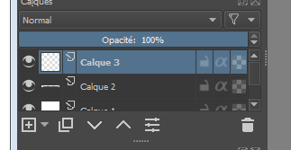


## Poser les images clées

Pour commencer on va ajouter les images clées une par une dans la *timeline* qui se trouve ne bas de l'interface. Ceci va nous permettre d'avoir une idée de l'animation finale et de sa fluidité.

Pour ajouter une image il faut faire un *clic droit* et sélectionner `Create Blank Frame` là où on veut la créer.

Si on a besoin de la déplacer il suffit de maintenir le clic dessus et de la glisser.

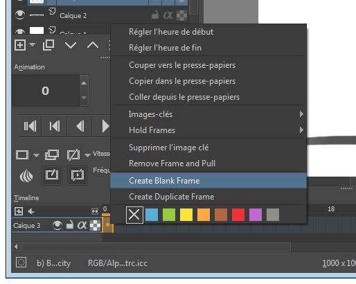

Dessiner la première image : la balle à son sommet.

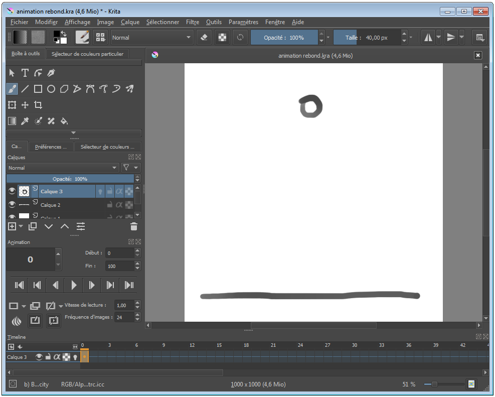


On  va créer la deuxième image clé : l'impacte de la balle sur le sol. Ça  n'arrive pas directement après la première image, alors on se donne de  la place et on la crée un peu plus loin.

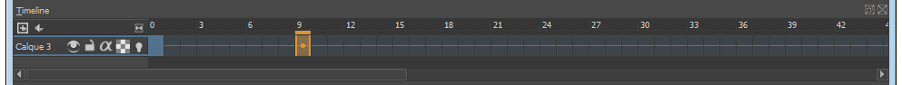


Activer la pelure d'oignon (ampoule allumée) dans la *timeline*.

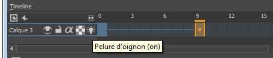


La **pelure d'oignon** est le nom que l'on donne à cette option qui nous **permet de voir les images d'avant et d'après**. Ça nous permet de pouvoir dessiner l'image actuelle avec plus de facilité.

Ici ça nous permet de pouvoir bien positionner l'image de l'impacte directement sous l'image du sommet.

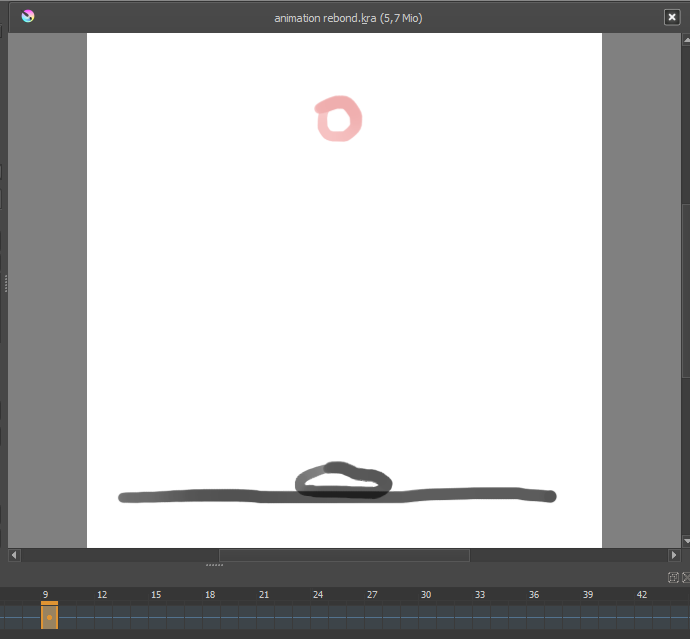


Pour  terminer ce premier passage de création d'images clées nous allons  dessiner la dernière image : le moment juste avant que la balle  atteingre son sommet.

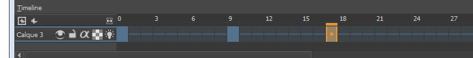


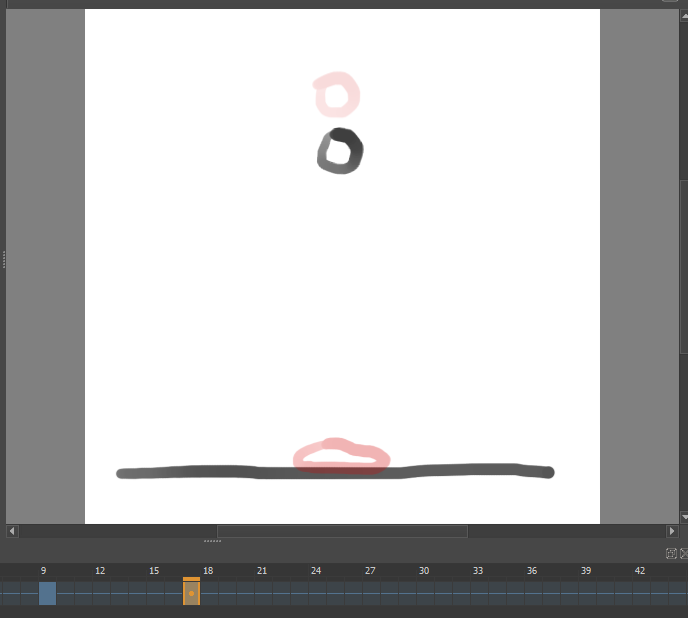


On va donc pouvoir voir à quoi ressemble l'animation pour le moment. Dans le module *Animation*,  modifier le chiffre de la dernière image de l'animation. Ça ne doit pas  necessairement être une image sur laquelle il y a un dessin.

Pour cet exemple nous allons mettre 18.

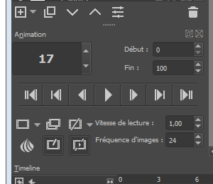


Désactiver la pelure d'oignon et jouer l'animation en cliquant sur le bouton *play* afin de voir le premier résultat.

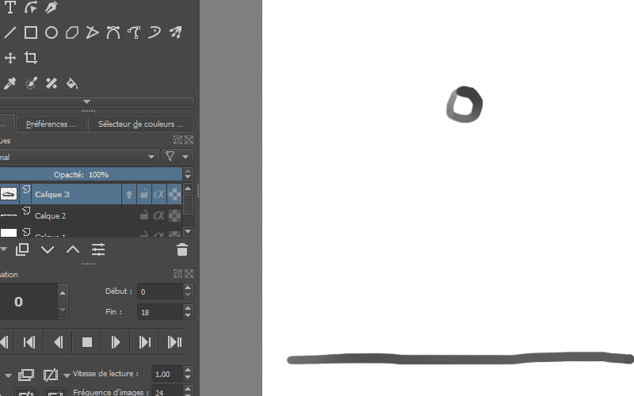


Réactiver la pelure d'oignon et insérer des images supplémetaires

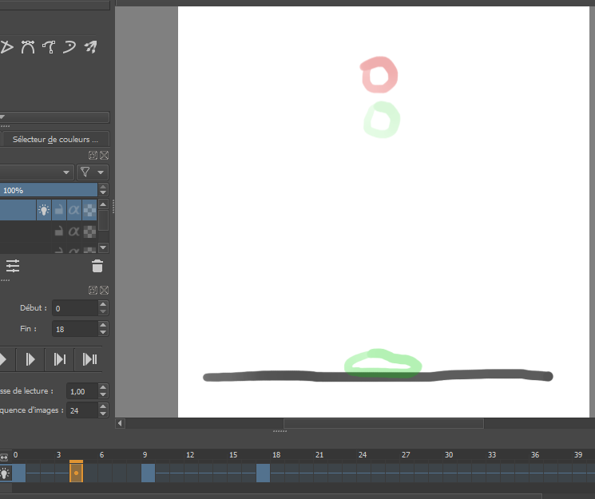


Si besoin, paramètrer la pelure d'oignon en cliquant sur le bouton oignon en bas à gauche du menu animation.

On peut choisir le nombre, la couleur et l'opacité des images qu'on veut voir avant et après l'image sélectionnée.

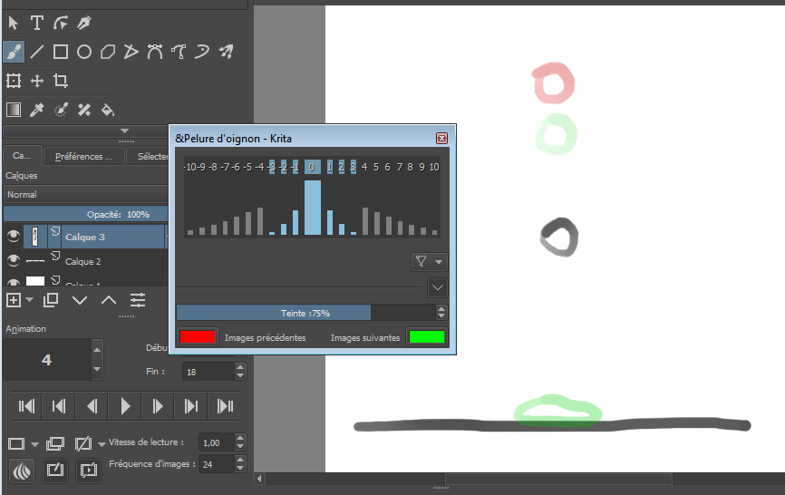


Après  avoir ajouté une autre image avant l'impact et une après le rebond on a  désormais une belle petite animation à partir de ces 6 images.

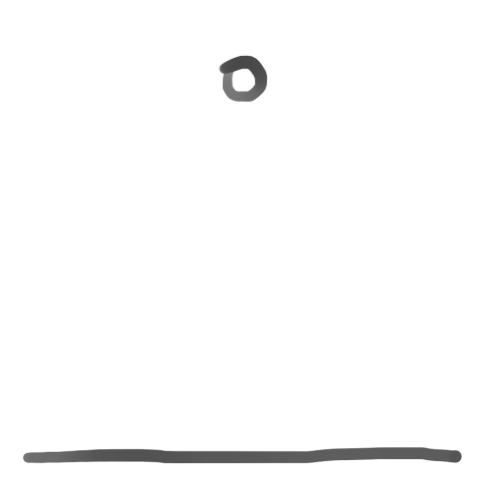


## Ajouter des images intermédiares

Une  fois les images clées dessinées on peut continuer de rajouter des  images intermédiares pour fluidifier l'animation ou directement passer à  l'étape suivante.

Cette étape est plus simple que la précédente  car l'essentiel est déjà dessiné, il suffit juste de remplir les trous  entre les images clées.


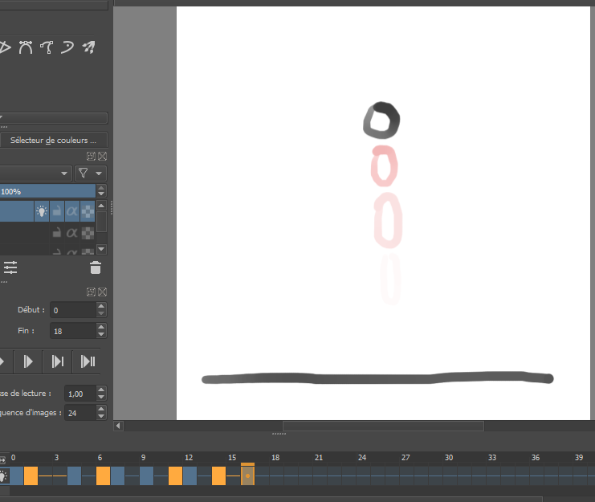


Voici  en bleu les images clées et en orange les images intermédiares pour  avoir une meilleur idée de ce qu'on a ajouté. On peut ensuite les  déplacées ou les ajuster voir même refaire les dessins pour un meilleur  résultat lors de l'animation.

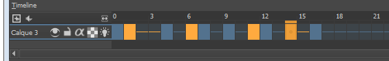


## Ajouter de la couleurs et des détails

Une fois satisfait de son animation on peut y ajouter de la couleur ou des détails.

Pour cette animation de rebond ce serait bien d'avoir un 'splash' lors de l'impacte.

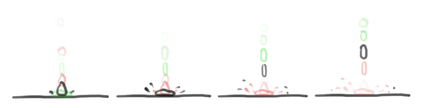


Il  y a d'autres détails que l'on peut essayer comme des lignes de vitesse  (lors de la decente et l'ascension), mais les résultats n'étaient pas  satisfaisant du coup nous avons fait sans.

**Voilà le résultat final :**


#### *Astuces*

Ce  n'est pas grave si nos images ne sont pas parfaites, elles ne durent  qu'un fragment de seconde et ça ne se verra pas tant qu'on le croit. Si  on a un doute, il faut jouer l'animation et voir ce qui saute aux yeux.

Je  vous encourage à expérimenter et d'essayer des choses pour voir si ça  marche. On est souvent surpris du résultat lors de l'animation.
