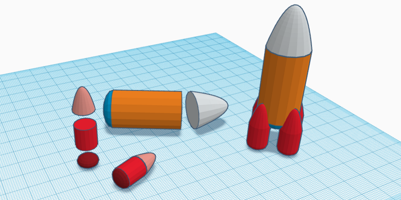

# Modélisation 3D

[retour à la liste des tutos](faire.md)

 *en construction*



Modéliser de la 3D c'est pas si compliqué !

```
durée : 30 minutes à 1 heure
```


**Les étapes :**

[TOC]

## Avoir une idée

Il suffit d'un idée simple, ne pas partir dans des idées trop compliquées, il faut pouvoir le faire soi même.

## La décomposer en formes simples

Dans sa tête ou sur une feuille de papier.


## La construire à partir des formes dans tinkercad

Voir le [guide de Tinkercad](../outils/tinkercad.md).
