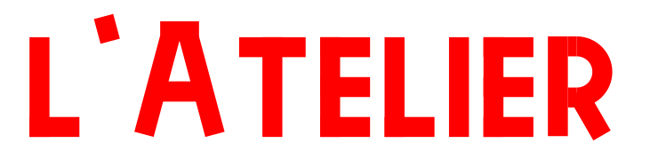

Bienvenu sur le guide de l'atelier de création de la médiathèque !

**Ici vous trouverez tout ce qui concerne l'atelier.**  Son programme, ce qu'on peut y faire à travers des tutoriels, des  guides d'utilisation pour savoir comment se servir des outils, des  conseils pour documenter votre travail et les règles et l'organisation  de l'atelier.

**Le guide est en construction constante**, il est amené à changer et à grandir avec le temps. Vous pouvez suivre son développement et voir les futurs révisions sur la [feuille de route](roadmap.md).


**Prochaines activités à l'atelier :**

```
mercredi 17 juillet - Création de cartes et posters en série

mercredi 24 juillet - Construction de fusées dans un jeu vidéo

mercredi 31 juillet - Autoportrait numérique

mercredi 07 août - Atelier broderie en famille

mercredi 20 août - Création musicale sur ordinateur
```


voir [la programmation de l'atelier](programmation.md) pour la liste de tous les prochains ateliers à venir.


## Qu'est-ce qu'on peut faire à l'atelier ?

 *guides à jour*


**J'ai envie de faire des choses mais j'ai pas d'idée !** Alors voici une liste de choses que l'on peut faire à l'atelier à travers des tutoriels qui vous suivent étapes par étapes.

Après  en avoir fait quelques uns vous aurez une meilleure idée de ce que vous  avez envie de faire et vous fabriquerez peut-être même des choses qui  ne sont pas dans les tutoriels !

[vers les tutos](faire.md)


## Comment se servir des outils de l'atelier ?

 *guides à jour*


**Une imprimante 3D ? Une découpeuse-quoi ?! C'est pas compliqué tout ça ?**  Pas si vous suivez les guides d'utilisation des outils de l'atelier.  Les machines ne seront plus des objets mystérieux qui font peur, mais de  simple outils que l'on utilise pour réaliser ses créations !

[vers le guide des outils](outils.md)


## Pourquoi et comment documenter ces travaux ?

 *en construction*


Comment documenter son travail et faire des tutoriels ?

[vers la page documentation](documentation.md)


## Règles et organisation de l'atelier

 *à jour*


**Comment ça fonctionne l'atelier et où est-ce qu'on range les gommes ?** Dans l'atelier il y a des règles à suivre, que ce soit pour des raisons de sécurité mais aussi pour mieux créer ensemble.

[vers les règles et l'organisation de l'atelier](organisation.md)


*-  guide maintenu par Alexandre Lejeune  -*
