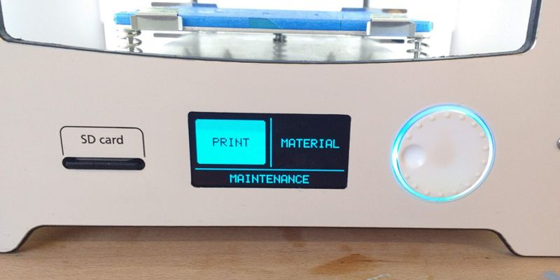
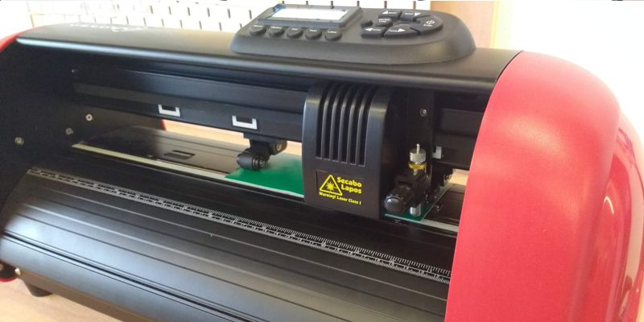
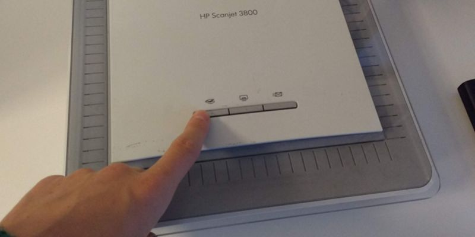
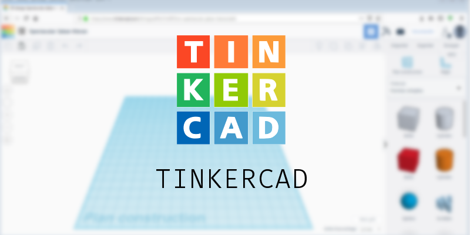
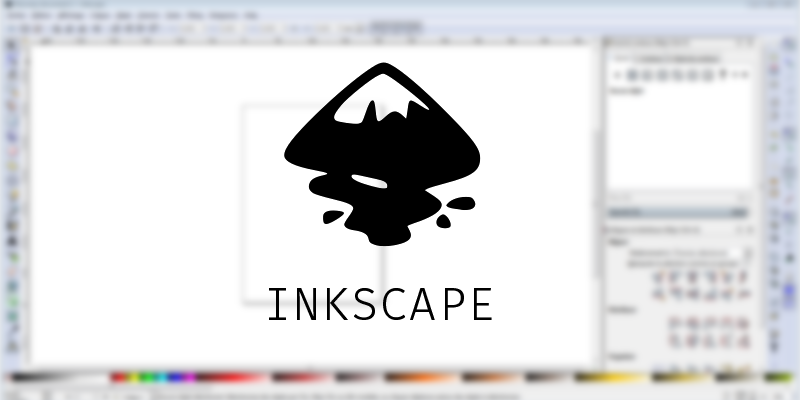

# Guide des outils

[Retour à l'accueil](index.md)

À  l'atelier il y a de nombreux outils, que ce soit des machines, des  logiciels, du matériel de bricolage ou de simples instruments de  dessins. Tous demandent de bien les connaître pour savoir correctement  les utiliser. Dans ce guide vous trouverez tout ce qu'il vous faut pour  apprendre à vous en servir.

 

[TOC]

## Les machines

Les  machines servent souvent à passer d'un format numérique à un résultat  matériel et vice versa. Que ce soit pour numériser un dessin ou imprimer  un modèle 3D, les guide d'utilisation des machines c'est ici !

 

### L'imprimante 3D

 *guide à jour*

L'imprimante  3D permet par le depot de couches succésives de filament de plastique  de matérialiser les modèles 3D fait sur l'ordinateur. [En savoir plus : l'impression 3D sur wikipedia](https://fr.wikipedia.org/wiki/Impression_3D)

Pour utiliser l'imprimante 3D il faut :

- avoir un fichier .stl ou .obj (exportation du modèle 3D)
- le préparer dans Cura
- transférer le fichier vers l'imprimante
- lancer l'impression

[vers le guide](outils/imprimante3D.html)

 

### Le plotter de découpe

 *guide à jour*

Le  plotter de découpe sert à découper avec précision grâce à l'ordinateur.  On peut s'en servir pour découper du papier ainsi que des rouleaux de  vinyle adhésif pour faire des autocollants. Il suffit de lui fournir un  tracé à suivre avec sa lame et elle se met à découper ! [En savoir plus : la découpe vinyle sur wikipedia](https://fr.wikipedia.org/wiki/Découpe_vinyle)

Les étapes pour utiliser la découpeuse :

- avoir un fichier .svg (exportation du tracé)
- le préparer dans DrawCut
- vérifier les paramètres de la machines
- tester la zone
- lancer la découpe

[vers le guide](outils/decoupeuse.md)

 

### Le scanner

 *guide à jour*

Le  scanner sert à numériser les dessins et les images, c'est à dire les  traduire en pixels pour que l'ordinateur puisse les lire et les  enregistrer.

Voici les étapes pour numériser :

- placer le dessin contre la vitre
- lancer la numérisation
- sélectionner l'option d'enregistrement
- récupérer le fichier numérisé

[vers le guide](outils/scanner.md)

 

## Les logiciels

On  l'oublie souvent avec toutes ces machines impréssionantes, mais les  logiciels sont aussi des outils très puissants et ils nous permettent de  faire plein de choses différentes. Ici vous trouverez les guides  d'utilisation des logiciels que nous utilisons à l'atelier, ils sont  tous gratuits donc si vous les trouvez intéréssants vous pouvez les  télécharger chez vous !

Pour savoir quels autres logiciels sont disponibles à l'atelier consulter la [liste des logiciels](outils/liste logiciels.md).

### Tinkercad

 *guide à jour*

Tinkercad  est un logiciel gratuit de modélisation 3D depuis le navigateur. Il met  à votre disposition une collection de formes simples à utiliser pour  construire toutes sortes de choses. On peut ensuite exporter les modèle  3D pour les imprimer en 3D.

[vers le guide](outils/tinkercad.md)

 

### Inkscape

 *guide à jour*

Inkscape  est un logiciel libre et gratuit qui permet de faire du dessin  vectoriel. Ça veut dire qu'en dessinant avec, l'ordinateur peut  comprendre notre tracé et le traduire en mathématiques (pour qu'on ait  pas à le faire nous-même). Ensuite on peut utiliser ce tracé pour  piloter des machines comme la découpeuse. [En savoir plus : les images vectorielles sur wikipedia](https://fr.wikipedia.org/wiki/Image_vectorielle)

 

[vers le guide](outils/vectorisation.md)

 

### Krita

 *en construction*

Krita est un logiciel de dessin sur ordinateur qui permet aussi de faire de l'animation. (voir les tutos [colorisation](faire/colorisation.md) et [dessin animé](faire/dessin anime.md) pour plus d'infos)
