# Tinkercad

[retour au guide des outils](outils.md)

 *guide à jour*

Tinkercad  est un logiciel de modélisation 3D simple.  Avec des formes basiques  qu'on va pouvoir assembler pour construire des formes plus complexe.

 

Déroulement d'un projet de modélisation :

- avoir une idée
- l'imaginer en formes simples
- poser des formes pour construire une base
- modifier et ajuster
- ajouter des détails

 

##Tinkercad
[Naviguation](#Navigation)
[Poser des formes et paramètres](#Poser)
[Déplacer les formes](#Déplacer)
[Redimensionner](#Redimensionner)
[Se déplacer (la caméra)](#Se)
[Les actions de bases](#Les)
[Regrouper et dissocier](#Regrouper)
[Perçages](#Perçages)
[Nommer son travail](#Nommer)
[Exporter](#Exporter)
[*Problèmes fréquents :*](#Problèmes)
[J'ai cliqué sur la forme scribble et l'ordi bug](#J'ai cliqué sur la forme scribble et l'ordi bug)

## Naviguation

### Poser des formes et paramètres

Pour poser une forme sur le plan de construction il suffit d'aller dans le menu de droite et de la glisser-déposer.

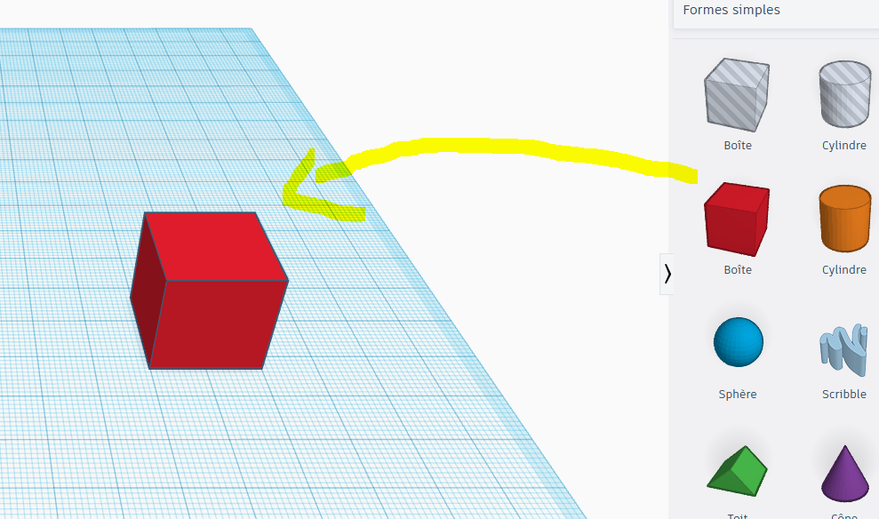

 

En  la selectionnant on aperçoit ses paramètres que l'on peut modifier si  on le souhaite. (C'est n'est souvent pas nécessaire tant qu'on a pas  compris les bases du logiciel)

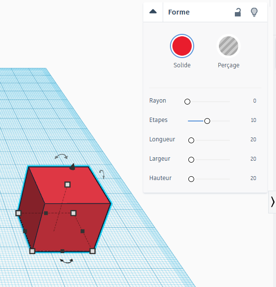

 

### Déplacer les formes

Pour  déplacer une forme sur le plan de construction, de gauche et à droite  (axe X) ou en avant et en arrière (axe Y) il suffit la sélectionner et  de maintenir le clic. On peut également utiliser les flèches ou en  saisir un chiffre dans les cases qui apparaissent.

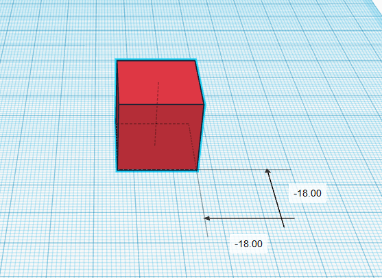

 

Pour la déplacer de haut en bas (axe Z), sélectionner la petite flèche noir :

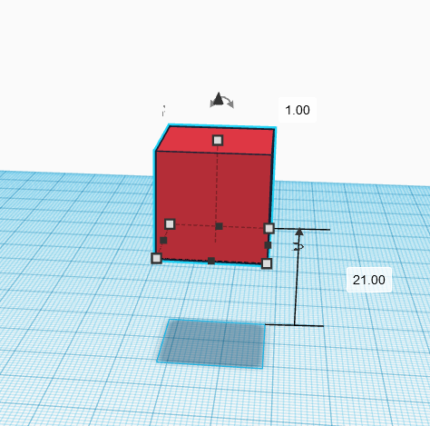

 

### Redimensionner

Les  formes que l'on place sur le plan de travail peuvent être  redimensionner. Pour cela il faut sélectionner les points afin d'étirer  ou rétressir la forme.

On peut également saisir une mesure précise (en millimètre) à l'aide du clavier.

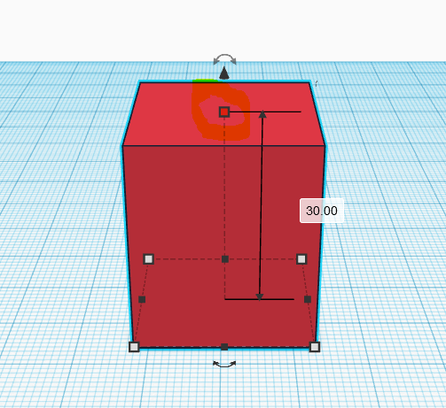

 

### Se déplacer (la caméra)

- bouger autour du plan = maintenir le clic droit
- zoomer et dézoomer = molette de la souris
- bouger le plan de travail = maintenir le clic de la molette

 

## Les actions de bases

### Regrouper et dissocier

Pour  former des formes plus complexes que celles de bases on peut les  assembler en groupe. Une fois le groupe former, ces formes agissent  comme une seule. Pour défaire le groupe il suffit de les dissocier.

*Rappel : pour sélectionner plusieurs éléments sur un ordinateur sélectionner le premier, appuyer et maintenir enfoncer Maj, sélectionner les suivants.*

**Avant** : les formes sont dissociées, pour les regrouper cliquer sur le bouton `regrouper`

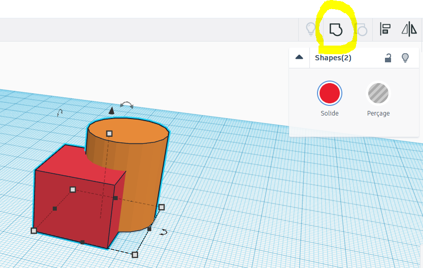

 

**Après** : les formes sont regroupées, pour les dissocier cliquer sur le bouton `dissocier`

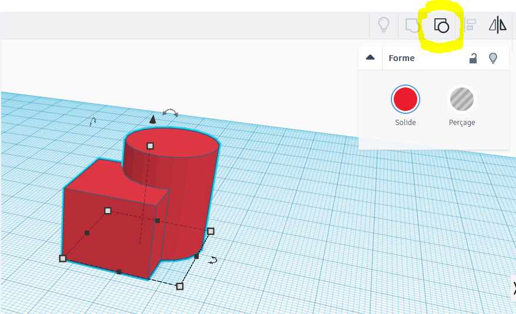

 

### Perçages

Le perçage est un des deux état des formes. Pour changer cet état, sélectionner une forme et choisir celui qui convient.

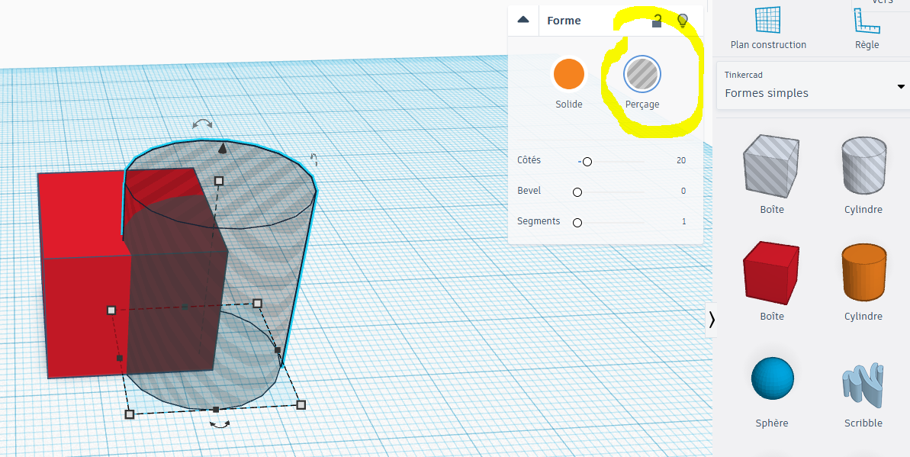

 

Pour effectuer le perçage il faut regrouper la forme dans laquelle on veut percer et la forme qui perce.

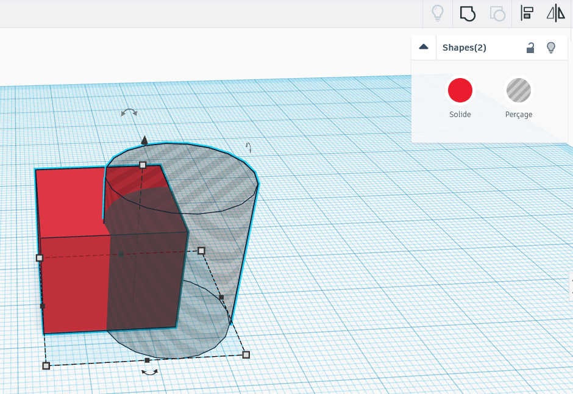

 

Et voilà le résultât :

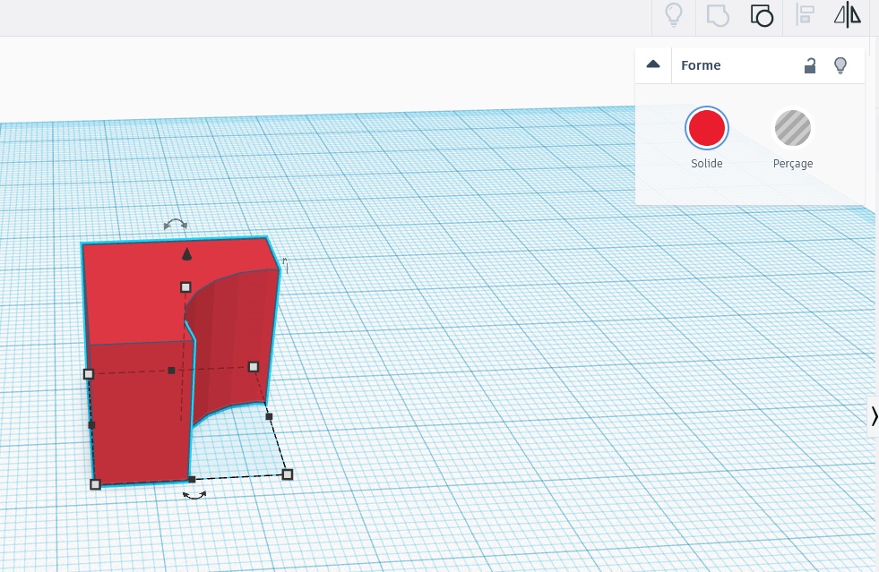

Si on souhaite annuler le perçage il suffit de dissocier les deux formes.

 

### Nommer son travail

Afin  de retrouver son travail dans la collection de créations on peut nommer  notre travail en cliquant sur le nom générer aléatoirement en haut à  gauche.

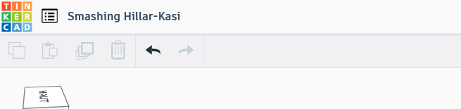

 

Choisir un nom descriptif et pas juste un prénom. Ex: "Alexandre cube cylindre"

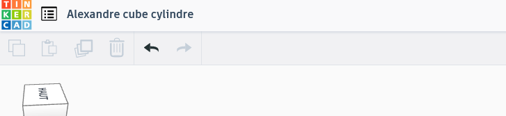

 

### Exporter

Pour pouvoir imprimer sa création il va falloir l'exporter. Choisir le format `.stl` ou `.obj`. Puis le télécharger ou l'ouvrir directement dans Cura.

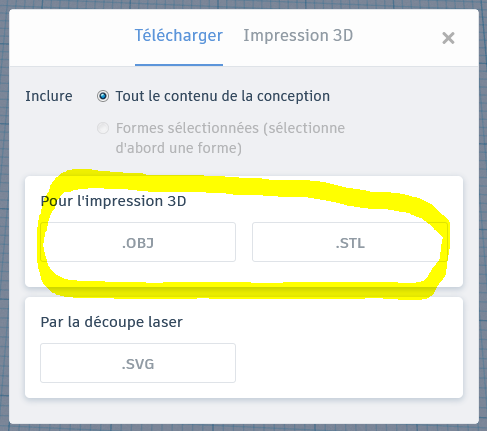

 

Pour savoir comment imprimer sa création voir le [guide d'impression 3D](imprimante3D.md).

 

### *Problèmes fréquents :*

#### J'ai cliqué sur la forme scribble et l'ordi bug

L'outil scribble doit démarrer une autre interface qui ralenti demande du temps à l'ordinateur, il suffit d'attendre.
